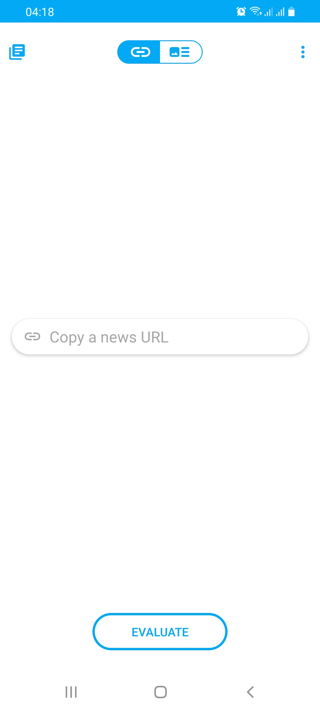

# Fake News Detection
Bachelor Thesis: A Deep Learning Framework for Multi-Modal Fake News Detection using Keras, accompanied by an android app demo. Implemented in PyCharm and Android Studio.
The paper is available for more details.

### Model Architecture

### Models
The folder 'FakeNewsDetectionModels' contains the models and the code to train them.

### Server
The folder 'FakeNewsAppServer' contains the code for the Python Server that communicates with the android app and is responsible for the inference.

### Android App
The folder 'FakeNewsDetection' is the project of the demo android app that can send article links or content to the Server and show the results.

## App Screenshots
Provide URL            |  Night Mode
:-------------------------:|:-------------------------:
 | 

Provide Content        | Inference Results
:-------------------------:|:-------------------------:
  |   
.
