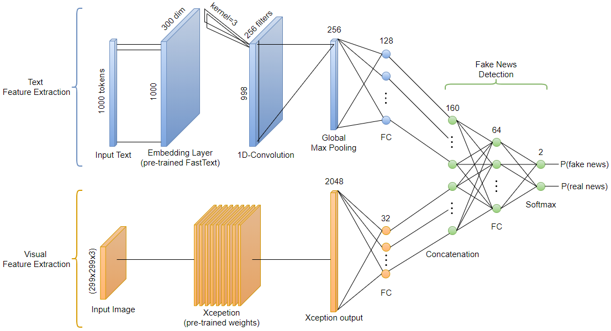

# Fake News Detection
Bachelor Thesis: A Deep Learning Framework for Multi-Modal Fake News Detection using Keras, accompanied by an android app demo. Implemented in PyCharm and Android Studio.
The paper is available for more details.

### Model Architecture

